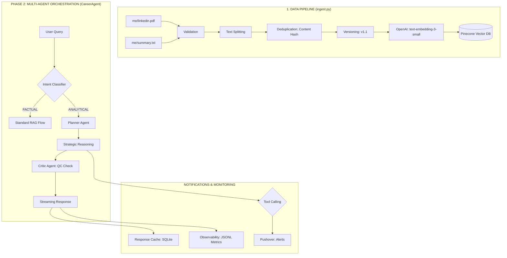

# Career Bot Workflow Documentation

This document explains the technical architecture and step-by-step flow of the Career Bot Pro's Retrieval-Augmented Generation (RAG) system.

## 1. High-Level Architecture

The system is divided into two main phases: **Data Ingestion** (Offline/One-time) and **Query Retrieval** (Online/Real-time).


> [!TIP]
> **View Visual Diagram**: If the image above or the Mermaid diagram below doesn't render, open [**RAG_WORKFLOW.html**](./RAG_WORKFLOW.html) in your browser to see the full interactive visualization.



---

## 2. Step-by-Step Flow

### Phase A: Data Ingestion (`ingest.py`)

1.  **Document Loading**: The script reads `me/linkedin.pdf` and `me/summary.txt`.
2.  **Chunking**: The text is split into small chunks (currently 500 characters with a 50-character overlap). This ensures that the context provided to the AI is granular and specific.
3.  **Embedding Generation**: Each chunk is sent to OpenAI's `text-embedding-3-small` model, which converts the text into a 1536-dimensional vector (a mathematical representation of meaning).
4.  **Vector Storage**: These vectors, along with the original text (metadata), are stored in the **Pinecone** index (`career-bot`).

### Phase B: Query Retrieval & Generation (`app-rag.py`)

1.  **User Input**: The user asks a question through the Gradio interface.
2.  **Vector Search**: The system converts the user's question into a vector and performs a "Similarity Search" against the Pinecone database.
3.  **Context Retrieval**: Pinecone returns the top 5 most relevant text chunks based on mathematical similarity (Cosine Similarity).
4.  **Prompt Construction**: The retrieved snippets are combined into a `context` block.
5.  **System Prompt Enrichment**: This context is injected into the system prompt, giving the AI specific facts to use for its answer.
6.  **LLM Execution**: The final prompt (History + System Prompt + Context + User Question) is sent to **OpenAI GPT-4o**.
7.  **Response**: The AI generates a professional response staying in character as Vishal Khoje.

---

## 3. Technology Stack

-   **LLM**: OpenAI GPT-4o
-   **Embeddings**: OpenAI `text-embedding-3-small`
-   **Vector Database**: Pinecone (Serverless)
-   **Framework**: LangChain (for orchestration)
-   **UI**: Gradio
-   **PDF Processing**: PyPDF

---

## 4. How to Update Data

Whenever you change your LinkedIn PDF or the summary text:
1.  Replace the files in the `me/` directory.
2.  Run the ingestion script:
    ```bash
    python3 ingest.py
    ```
    *Note: This will re-index your documents in Pinecone.*

## 8. Production Observability

The system includes a dedicated observability layer ([src/monitoring.py](./src/monitoring.py)) that tracks:

- **Request Latency**: Total time from user input to final streaming chunk.
- **Token Usage**: Captured via OpenAI usage stats (even for streaming).
- **Tool Performance**: Success/failure rates and execution duration for every tool call.
- **Structured Logs**: All events are saved to `career_bot_metrics.jsonl` in JSON format, ready for ingestion by monitoring tools like Datadog or ELK.

### Sample Observability Log
```json
{
  "timestamp": "2026-04-27T12:55:06Z",
  "query_preview": "Who are you?",
  "latency_ms": 3048,
  "token_usage": 2277,
  "status": "success",
  "cache_hit": false
}
```

## 9. Evaluation System

The system includes a comprehensive evaluation framework ([src/evaluation.py](./src/evaluation.py)) for continuous quality improvement.

### Offline Evaluation
- **Dataset**: A gold-standard set of queries and expected answers is stored in [tests/eval_dataset.json](./tests/eval_dataset.json).
- **Runner**: The [tests/run_offline_eval.py](./tests/run_offline_eval.py) script benchmarks the bot on:
  - **Correctness**: Factual accuracy.
  - **Groundedness**: Adherence to the provided context.
  - **Completeness**: How well all parts of the query are answered.

### Online Evaluation (User Feedback)
- **UI Integration**: Users can provide direct feedback (👍/👎) in the chat interface.
- **Persistence**: Feedback is stored in `evaluations.db` and linked to the specific request for later analysis.

### Auto-Evaluation (LLM-as-a-Judge)
After every response, an independent LLM agent evaluates the output for:
- **Hallucination Risk**: (0.0 to 1.0) Identifying information not present in the context.
- **Relevance**: (0.0 to 1.0) Ensuring the answer directly addresses the user's intent.
