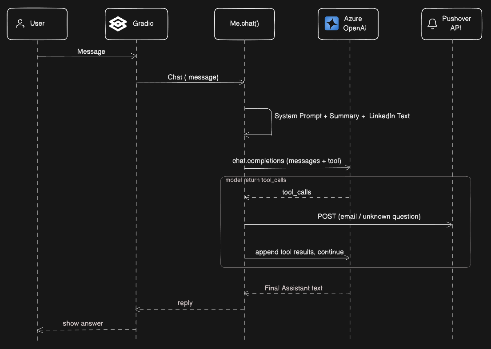
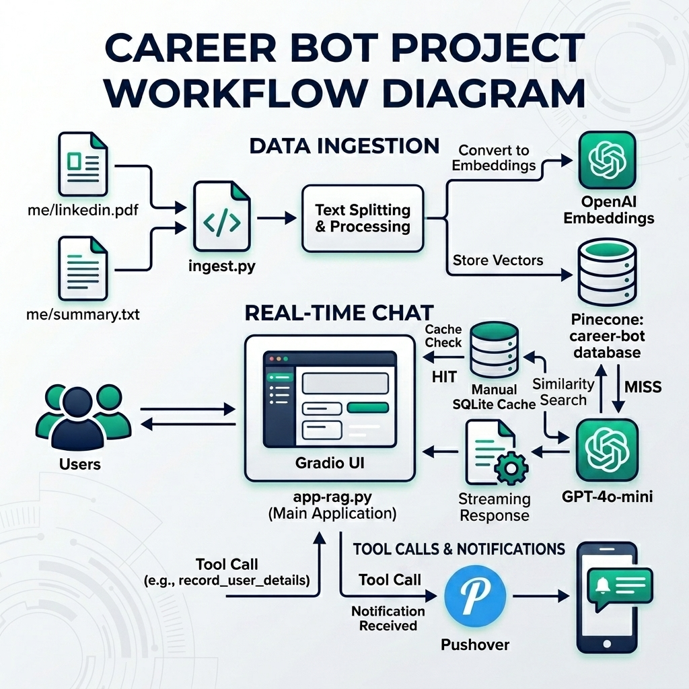
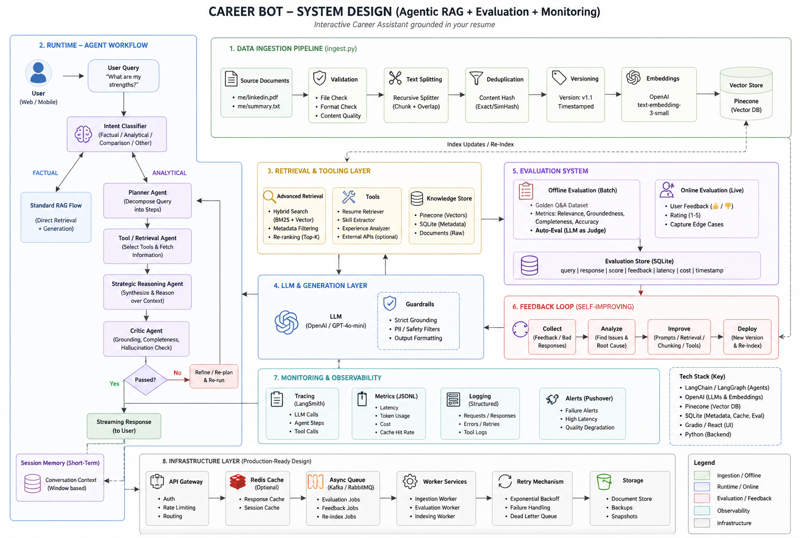
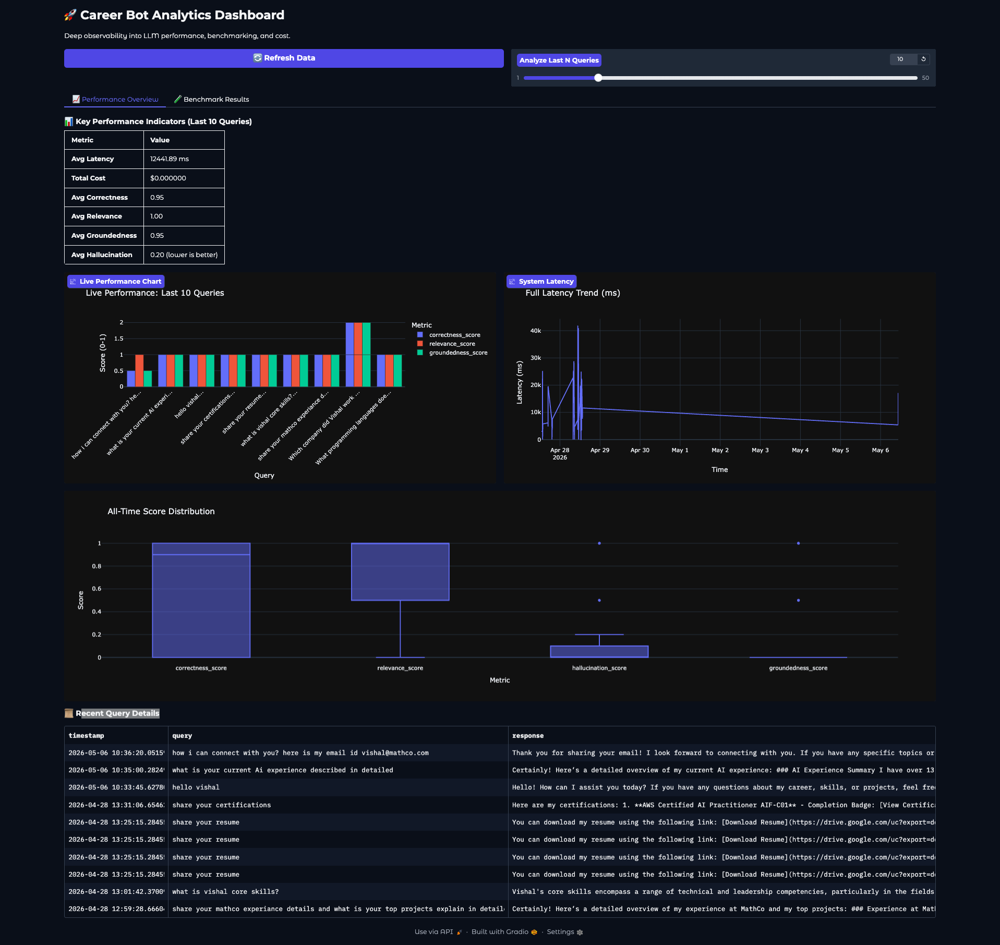

# 🚀 Career Conversation AI Bot

g

---

## 🏗️ Project Versions

### 📂 [1_simple_bot](./1_simple_bot) (The Baseline)
This was the first phase of the project. It reads the entire LinkedIn PDF and summary text once and injects it directly into the LLM system prompt.
- **Main Script**: `app.py`
- **Key Features**: Lightweight, no database required, uses Azure OpenAI.
- **Best For**: Quick testing and small context windows.



### 📂 [2_rag_bot](./2_rag_bot) (The Production Version)
An advanced implementation using **Retrieval-Augmented Generation (RAG)**, Multi-Agent orchestration, and deep observability.
- **Main Script**: `app-rag.py`
- **Architecture**: Hybrid Retrieval (Vector + BM25) + FlashRank Re-ranking.
- **Agents**: Intent Classifier -> Planner -> Tool Executor -> Critic.
- **Best For**: Large document sets, accuracy, and enterprise-level monitoring.

---

## 📐 System Design & Workflow

### Stage 2: Agentic Workflow
The bot uses a multi-agent orchestration pattern to handle complex queries, moving from simple intent classification to strategic planning and execution.


### Stage 3: Full System Architecture (RAG)
The production version implements a robust RAG pipeline with hybrid search, re-ranking, and deep observability.


---

## 📋 Minimum System Requirements

-   **OS**: macOS, Linux, or Windows (via WSL2).
-   **Python**: 3.10 or higher.
-   **Memory**: 4GB RAM (8GB recommended for FlashRank local models).
-   **API Keys**: OpenAI/Azure OpenAI API, Pinecone API.
-   **Optional**: Pushover (for alerts), LangSmith (for tracing).

---

## 🛠️ Installation & Setup

### 1. Clone and Navigate
```bash
git clone <repository-url>
cd career_conversation
```

### 2. Environment Setup
```bash
python3 -m venv .venv
source .venv/bin/activate
```

### 3. Install Dependencies
Each bot has its own requirements:
```bash
# For Simple Bot
pip install -r 1_simple_bot/requirements.txt

# For RAG Bot (Recommended)
pip install -r 2_rag_bot/requirements.txt
```

### ⚡ Fast Setup with `uv` (Recommended)
If you have [uv](https://github.com/astral-sh/uv) installed, you can set up the environment and run the project significantly faster:

```bash
# 1. Create venv and install dependencies
uv venv
source .venv/bin/activate
uv pip install -r 2_rag_bot/requirements.txt

# 2. Run the ingest pipeline
cd 2_rag_bot
uv run ingest.py

# 3. Start the combined chatbot & dashboard
uv run python app.py
```

### 4. Configuration
Create a `.env` file in the bot's directory (e.g., `2_rag_bot/.env`):
```env
# Core API Keys
OPENAI_API_KEY=your_openai_key
PINECONE_API_KEY=your_pinecone_key
PINECONE_INDEX_NAME=career-bot

# Azure OpenAI (Required for 1_simple_bot)
AZURE_OPENAI_ENDPOINT=your_endpoint
AZURE_OPENAI_API_KEY=your_key
AZURE_OPENAI_DEPLOYMENT=gpt-4o

# Observability
LANGCHAIN_TRACING_V2=true
LANGSMITH_API_KEY=your_langsmith_key
```

---

## 🚀 Running the Project

### Option A: The Production RAG Bot (Recommended)
To run the Chatbot and the Analytics Dashboard integrated in tabs under a single page:
- **Run Combined App**: `uv run python app.py` (Port 7860)

Alternatively, you can run them individually:
1.  **Ingest Data**: `uv run python 2_rag_bot/ingest.py`
2.  **Start Chatbot Only**: `uv run python 2_rag_bot/app-rag.py` (Port 7860)
3.  **Start Dashboard Only**: `uv run python 2_rag_bot/dashboard.py` (Port 7861)

### Option B: The Lightweight Simple Bot
Navigate to `1_simple_bot/`:
1.  **Start Server**: `python3 app.py` (or `uv run app.py`) (Port 7860)

---

## 📊 Observability (RAG Bot Only)

The production version implements **Deep Observability**:
-   **Request ID Tracking**: Links queries to tool calls and evaluations.
-   **Latency Breakdown**: Tracks time spent in Intent vs. Retrieval vs. Generation.
-   **Cost Tracking**: Real-time USD cost estimation per request.
-   **Monitoring**: Structured JSON logs in `career_bot_metrics.jsonl`.

### Analytics Dashboard


---

## 🧪 Testing

### RAGAS Offline Evaluation
To evaluate the RAG bot's performance on the offline gold-standard dataset using the RAGAS framework (requires OpenAI API tokens):

```bash
uv run python 2_rag_bot/tests/run_offline_eval.py
```
This script computes Context Precision, Context Recall, Faithfulness, and Answer Relevancy, saving the summary to the database (`evaluations.db`).

### System Verification
Run the verification suite for the RAG bot:
```bash
cd 2_rag_bot
python3 tests/verify_refactored.py
```

---

## 🛠️ Troubleshooting

- **`ModuleNotFoundError: No module named 'src'`**: Ensure you are running from the `2_rag_bot/` root directory.
- **Azure/OpenAI API Errors**: Verify your keys and deployments in the `.env` file.
- **FlashRank Cache**: If first run is slow, it's downloading the re-ranker model (~100MB).

---

## ⚖️ License
Internal Project - All Rights Reserved.
